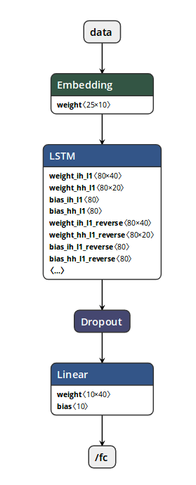

# DeepLoc
Predicting protein subcellular localization using deep learning



## Requirements

```
virtualenv -p python3 .env
source .env/bin/activate
pip install -r requirements.txt
```
##
- Download [dataset](http://www.cbs.dtu.dk/services/DeepLoc/data.php). Then, move it to 'data' folder.
## Steps

1. __Build the dataset__ Run the following script
```
python build_dataset.py
```
It will extract the sentences and classes from the dataset, split it into train/val/test and save it in a convenient format for model.

2. __Build__ vocabularies and parameters for dataset by running
```
python build_vocab.py --data_dir data/
```
It will write vocabulary files `chars.txt` and `classes.txt` containing the amino acid notations and classes in the dataset. It will also save a `dataset_params.json` with some extra information.

3. __Train__ Simply run
```
python train.py --data_dir data --model_dir experiments/base_model
```
It will instantiate a model and train it on the training set following the hyperparameters specified in `params.json`. It will also evaluate some metrics on the development set.

4. __First hyperparameters search__ Created a new directory `learning_rate` in `experiments`. Now, run
```
python search_hyperparams.py --data_dir data --parent_dir experiments/learning_rate
```
It will train and evaluate a model with different values of learning rate defined in `search_hyperparams.py` and create a new directory for each experiment under `experiments/learning_rate/`.

5. __Display the results__ of the hyperparameters search in a nice format
```
python synthesize_results.py --parent_dir experiments/learning_rate
```

6. __Evaluation on the test set__ Run many experiments and selected  best model and hyperparameters based on the performance on the development set,finally evaluate the performance of  model on the test set. Run
```
python evaluate.py --data_dir data --model_dir experiments/base_model
```

## References

- [CS230 Deep Learning](https://github.com/cs230-stanford/cs230-stanford.github.io)
- [Paper](https://academic.oup.com/bioinformatics/article/33/21/3387/3931857)
